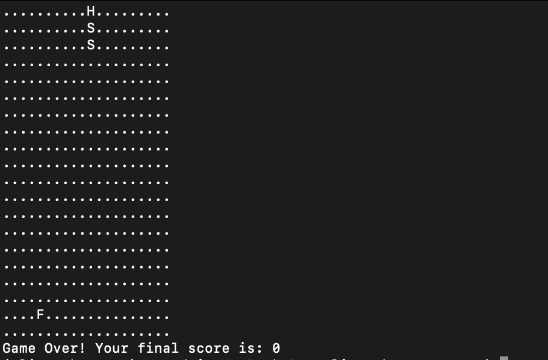

# methaGPT snake game generation in the Docker
This folder contains MetaGPT configurations and results of generation
of Python code for the Snake game.

Multi-agent Collaboration, MetaGPT, Docker, Standardized Operating Procedures (SOPs), Code Generation

### Prerequisites
* Docker

### How to configure and run MetaGPT (MULTI-AGENT COLLABORATIVE FRAMEWORK) in Docker:

https://docs.deepwisdom.ai/main/en/guide/get_started/installation.html#install-with-docker

```docker pull metagpt/metagpt:latest```

Check image in Docker Desktop

create folder for the metaGPT docker experementing (already in this git folder)


cd agents/metaGPT_docker_snake


```mkdir -p agents/metaGPT_docker_snake/metagpt/{config,workspace}```

```docker run --rm metagpt/metagpt:latest cat /app/metagpt/config/config2.yaml > agents/metaGPT_docker_snake/metagpt/config/config2.yaml```

File created in the host's filesystem.
```agents/metaGPT_docker_snake/metagpt/config/config2.yaml```


Put your OpenAI API Key in to the host's filesystem config2.yaml

```vi agents/metaGPT_docker_snake/metagpt/config/config2.yaml```


### run MetaGPT snake game generation


Run metagpt demo with container. This command uses Docker to run a containerized version of the metagpt application and execute a specific task ("Write a CLI snake game") within that container. 

```
docker run --rm \
    --privileged \
    -v agents/metaGPT_docker_snake/metagpt/config/config2.yaml:/app/metagpt/config/config2.yaml \
    -v agents/metaGPT_docker_snake/metagpt/workspace:/app/metagpt/workspace \
    metagpt/metagpt:latest \
    metagpt "Write a cli snake game"
```

[Game generation log file](readme_files/generation.log)

Generated artifacts:
folder ```metagpt/workspace/cli_snake_game/cli_snake_game``` contains Python files main.py, game.py, utils.py


### run generated Snake game 

```
cd /metagpt/workspace/cli_snake_game/cli_snake_game

python3 -m venv .
source bin/activate
pip install keyboard
python3 main.py 
```

Play the game




