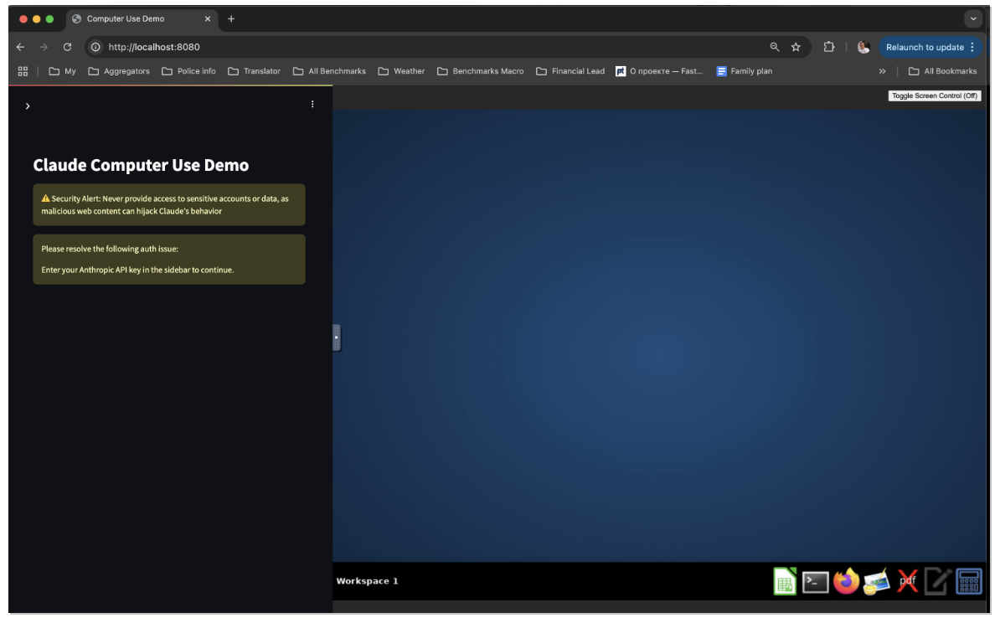
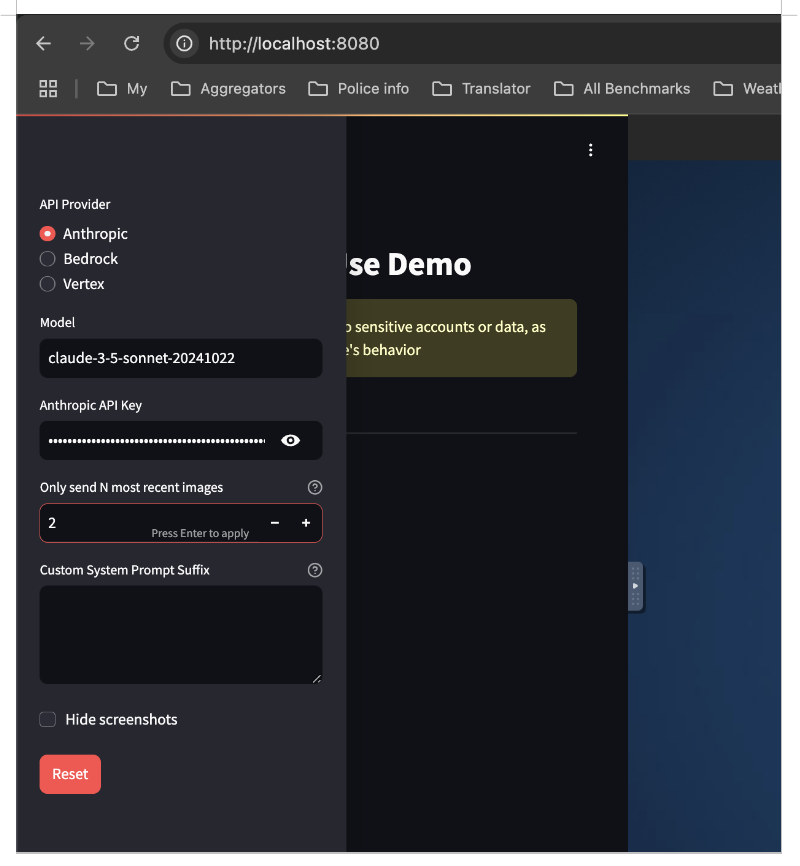
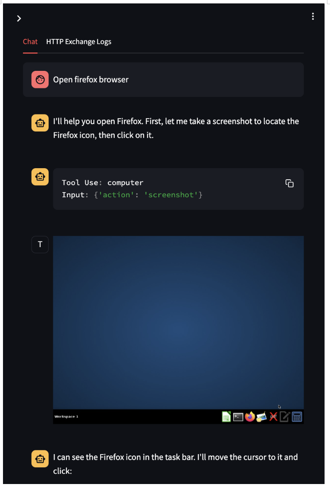
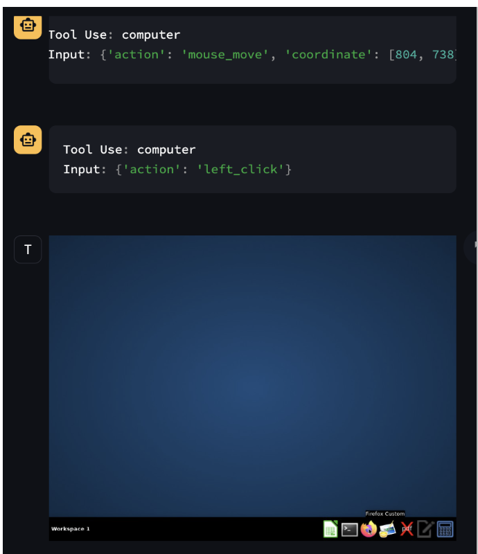
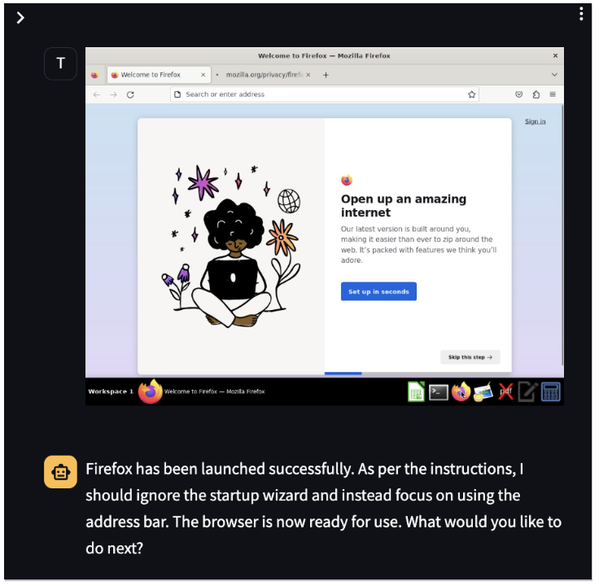

# Run Anthropic Computer Use Demo locally
This folder helps you get started with computer use on Claude, with reference implementations of:

* Build files to create a Docker container with all necessary dependencies
* A computer use agent loop using the Anthropic API to access the updated Claude 3.5 Sonnet model
* Anthropic-defined computer use tools
* A streamlit app for interacting with the agent loop


## Useful links
[Computer use (beta) doc](https://docs.anthropic.com/en/docs/build-with-claude/computer-use)

[Anthropic Computer Use Demo on GitHub](https://github.com/anthropics/anthropic-quickstarts/tree/main/computer-use-demo)

## How to run locally
**Get your Anthropic API key ready**\
**Get Docker installed on your PC**


```cd anthropic_computer_use_docker```

```docker build -t claude_image .```

```docker run -it --rm -p 8080:8080 -p 8501:8501 -p 6080:6080 claude_image```

```
MacBook-Pro:computer-use-demo$ docker run -it --rm -p 8080:8080 -p 8501:8501 -p 6080:6080 claude_image
Xvfb started successfully on display :1
Xvfb PID: 9
starting tint2 on display :1 ...
starting mutter
starting vnc
PORT=5900
starting noVNC
noVNC started successfully
✨ Computer Use Demo is ready!
➡️  Open http://localhost:8080 in your browser to begin
```

Go to browser, open http://localhost:8080/


Enter your Anthropic API key and set number of most recent images to 2 (to save your money)


Open Firefox session 
Open Firefox - Chat messages


