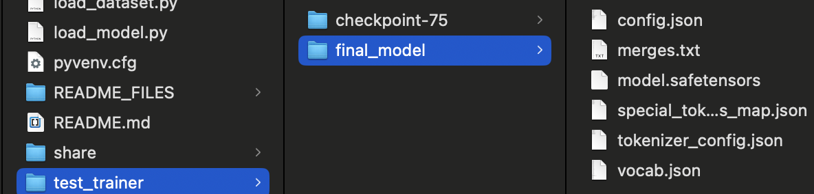
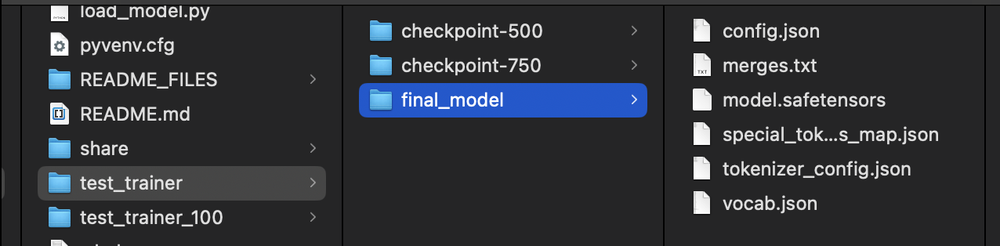
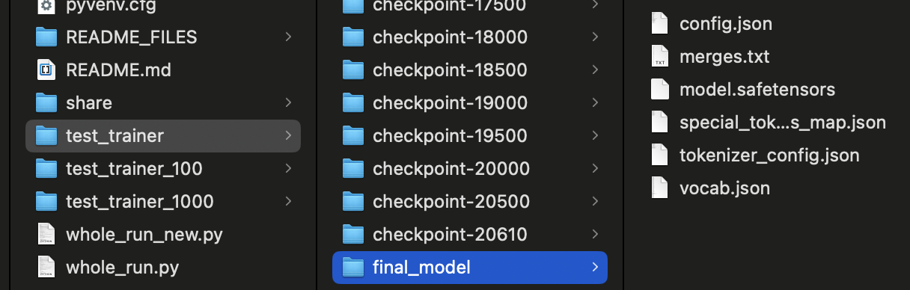

# Fine-tuning GPT-2 for sentiment extraction  example

## Table of Contents

- [Introduction](#fine-tuning-gpt-2-for-sentiment-extraction-example)
- [What is in this example?](#what-is-in-this-example)
- [Preparing the environment](#preparing-the-environment)
    - [venv and packages](#venv-and-packages)
    - [model](#model)
    - [Dataset](#dataset)
- [Laptop configuration](#laptop-configuration)
- [Python files](#python-files)
- [Fine-tuning with 100/1000/27481 train data set](#fine-tuning-with-100100027481-train-data-set)
    - [100 items train and test datasets](#100-items-train-and-test-datasets)
    - [1000 items train and test datasets](#1000-items-train-and-test-datasets)
    - [whole train and test datasets](#whole-train-and-test-datasets)
- [useful links](#useful-links)


## What is in this example?

This example demonstrates how to fine-tune GPT-2 from the Hugging Face Transformers library for a sequence classification task (e.g., sentiment analysis). It covers the full process of data preparation, model fine-tuning, evaluation, and inference.

Used dataset:  tweet sentiment extraction from Hugging Face library.

Fine-tuning mode: Full fine-tuning of the GPT-2 model for a sequence classification task. The Trainer is instantiated with the full model (GPT2ForSequenceClassification) without freezing any layers.

**Technologies and frameworks used:**\
Hugging Face Transformers Library: Models (GPT2ForSequenceClassification), Tokenizer (GPT2Tokenizer), Trainer, Pipeline; Hugging Face Datasets Library; Hugging Face Evaluate Library; GPT-2 model;  NumPy, Pandas


## Preparing the environment
## venv and packages
`pip install transformers`\
`pip install datasets`\
`pip install torch torchvision torchaudio`\
`pip install evaluate`\
`pip install scikit-learn` # The 'sklearn' PyPI package is deprecated, use 'scikit-learn' rather than 'sklearn' for pip commands.\
`pip install transformers[torch]`\
`pip install numpy`

### model 
https://huggingface.co/transformers/v3.3.1/model_doc/gpt2.html\
Creates and initializes a GPT-2 model transformer model from the Hugging Face library 
for a sequence classification task. The classification task has 3 distinct classes (e.g., positive, negative, neutral for sentiment analysis). The classification head will have 3 output neurons corresponding to these labels. A randomly initialized classification head (a linear layer) is added on top of the GPT-2.

Size on HDD: 551 MB\
Local HDD location  `~/.cache/huggingface/hub/models--gpt2`


### Dataset
dataset [tweet_sentiment_extraction](https://huggingface.co/datasets/mteb/tweet_sentiment_extraction)

```
>>> df.info
<bound method DataFrame.info of                id                                               text  label label_text
0      cb774db0d1                I`d have responded, if I were going      1    neutral
1      549e992a42      Sooo SAD I will miss you here in San Diego!!!      0   negative
2      088c60f138                          my boss is bullying me...      0   negative
3      9642c003ef                     what interview! leave me alone      0   negative
4      358bd9e861   Sons of ****, why couldn`t they put them on t...      0   negative
...           ...                                                ...    ...        ...
27476  4eac33d1c0   wish we could come see u on Denver  husband l...      0   negative
27477  4f4c4fc327   I`ve wondered about rake to.  The client has ...      0   negative
27478  f67aae2310   Yay good for both of you. Enjoy the break - y...      2   positive
27479  ed167662a5                         But it was worth it  ****.      2   positive
27480  6f7127d9d7     All this flirting going on - The ATG smiles...      1    neutral

[27481 rows x 4 columns]>
```

Local HDD location `~/.cache/huggingface/datasets/mteb___tweet_sentiment_extraction/default/0.0.0/62146448f05be9e52a36b8ee9936447ea787eede/dataset_info.json`


## Laptop configuration
Apple M3 Pro\
18 GB\
11-core CPU with 5 performance cores and 6 efficiency cores, 12-core CPU with 6 performance cores and 6 efficiency cores.\
14-core GPU, 18-core GPU.\
Hardware-accelerated ray tracing.\
16-core Neural Engine.\
150GB/s memory bandwidth.


# Python files

**load_model.py**\
loads model

**load_dataset.py**\
loads dataset

**calc_baseline_accuracy.py**\
The script calculates baseline accuracy for a sentiment analysis dataset using the Hugging Face Transformers and Datasets libraries. Baseline accuracy provides a simple performance metric by predicting the most common class in the dataset.
For ther original GPT-2 before  fine-tuning.

**whole_run.py**\
This Python script demonstrates how to fine-tune GPT-2 from the Hugging Face Transformers library for a sequence classification task (e.g., sentiment analysis). It covers the full process of data preparation, model fine-tuning, evaluation, and inference.

**call_fine_tuned.py**\
Loads the fine-tuned model for inference

# Fine-tuning with 100/1000/27481 train data set

## 100 items train and test datasets
Size of tokenized train dataset: 100\
Baseline Eval Accuracy: 0.35\
Fine-tuned Model Eval Accuracy: 0.32\
Training time: 20 seconds

### log
```
python whole_run.py
tokenized_datasets start
tokenized_datasets done
train_dataset_size= 100
eval_dataset_size= 100
Calculating Baseline Accuracy for train and eval datasets...
Baseline Accuracy: 0.37
Baseline Accuracy: 0.35
GPT2ForSequenceClassification.from_pretrained start
Some weights of GPT2ForSequenceClassification were not initialized from the model checkpoint at gpt2 and are newly initialized: ['score.weight']
You should probably TRAIN this model on a down-stream task to be able to use it for predictions and inference.
GPT2ForSequenceClassification.from_pretrained done
trainer.train() start
{'train_runtime': 143.6725, 'train_samples_per_second': 2.088, 'train_steps_per_second': 0.522, 'train_loss': 5.694891357421875, 'epoch': 3.0}                                             
100%|██████████████████████████████████████████████████████████████████████████████████████████████████████████████████████████████████████████████████████| 75/75 [02:23<00:00,  1.92s/it]
trainer.train() done
Training completed in 143.75 seconds.
Saving the final fine-tuned model...
Final model saved to test_trainer/final_model.
trainer.evaluate() start
100%|████████████████████████████████████████████████████████████████████████████████████████████████████████████████████████████████████████████████████| 100/100 [00:18<00:00,  6.42it/s]compute_metrics(eval_pred) {'accuracy': 0.32}
100%|████████████████████████████████████████████████████████████████████████████████████████████████████████████████████████████████████████████████████| 100/100 [00:19<00:00,  5.26it/s]
trainer.evaluate() done
Evaluation completed in 19.25 seconds.

=== Model Performance Improvement ===
Baseline Train Accuracy: 0.37
Baseline Eval Accuracy: 0.35
Fine-tuned Model Eval Accuracy: 0.32
The fine-tuned model did not improve performance over the baseline.

```
### What is in `test_trainer` folder



### call_fine_tuned.py result for fine tuned model
```
call_fine_tuned.py 
Loading fine-tuned model for inference...
Device set to use mps:0
Inference results:
Text: This is a great product!, Prediction: [{'label': 'LABEL_1', 'score': 0.8455848693847656}]
Text: I am very disappointed with the service., Prediction: [{'label': 'LABEL_1', 'score': 0.832330584526062}]
Text: It was an average experience., Prediction: [{'label': 'LABEL_1', 'score': 0.7957491278648376}]
```
## 1000 items train and test datasets
Size of tokenized train dataset: 1000\
Baseline Eval Accuracy: 0.41\
Fine-tuned Model Eval Accuracy: 0.57\
Training time: 2 minutes 

### log
```
python whole_run.py
tokenized_datasets start
tokenized_datasets done
train_dataset_size= 1000
eval_dataset_size= 1000
Calculating Baseline Accuracy for train and eval datasets...
Baseline Accuracy: 0.38
Baseline Accuracy: 0.41
GPT2ForSequenceClassification.from_pretrained start
Some weights of GPT2ForSequenceClassification were not initialized from the model checkpoint at gpt2 and are newly initialized: ['score.weight']
You should probably TRAIN this model on a down-stream task to be able to use it for predictions and inference.
GPT2ForSequenceClassification.from_pretrained done
trainer.train() start
{'loss': 4.4075, 'grad_norm': 25.377676010131836, 'learning_rate': 1.6666666666666667e-05, 'epoch': 2.0}                                                                                   
{'train_runtime': 1404.6564, 'train_samples_per_second': 2.136, 'train_steps_per_second': 0.534, 'train_loss': 4.2312500813802085, 'epoch': 3.0}                                           
100%|████████████████████████████████████████████████████████████████████████████████████████████████████████████████████████████████████████████████████| 750/750 [23:24<00:00,  1.87s/it]
trainer.train() done
Training completed in 1404.75 seconds.
Saving the final fine-tuned model...
Final model saved to test_trainer/final_model.
trainer.evaluate() start
100%|██████████████████████████████████████████████████████████████████████████████████████████████████████████████████████████████████████████████████| 1000/1000 [02:33<00:00,  6.56it/s]compute_metrics(eval_pred) {'accuracy': 0.57}
100%|██████████████████████████████████████████████████████████████████████████████████████████████████████████████████████████████████████████████████| 1000/1000 [02:33<00:00,  6.51it/s]
trainer.evaluate() done
Evaluation completed in 153.94 seconds.

=== Model Performance Improvement ===
Baseline Train Accuracy: 0.38
Baseline Eval Accuracy: 0.41
Fine-tuned Model Eval Accuracy: 0.57
The fine-tuned model has improved performance over the baseline.

```
### What is in `test_trainer` folder


### call_fine_tuned.py result for fine tuned model
```
all_fine_tuned.py 
Loading fine-tuned model for inference...
Device set to use mps:0
Inference results:
Text: This is a great product!, Prediction: [{'label': 'LABEL_1', 'score': 0.586778998374939}]
Text: I am very disappointed with the service., Prediction: [{'label': 'LABEL_1', 'score': 0.5055798888206482}]
Text: It was an average experience., Prediction: [{'label': 'LABEL_1', 'score': 0.5881729125976562}]

```


## whole train and test datasets
Size of tokenized train dataset: 27481\
Baseline Eval Accuracy: 0.40\
Fine-tuned Model Eval Accuracy: 0.79\
Training time: 643 minutes 

### log
```
whole_run.py
tokenized_datasets start
tokenized_datasets done
Size of tokenized train dataset: 27481
Size of tokenized test dataset: 3534
Calculating Baseline Accuracy for train and eval datasets...
Baseline Accuracy: 0.40
Baseline Accuracy: 0.40
GPT2ForSequenceClassification.from_pretrained start
Some weights of GPT2ForSequenceClassification were not initialized from the model checkpoint at gpt2 and are newly initialized: ['score.weight']
You should probably TRAIN this model on a down-stream task to be able to use it for predictions and inference.
GPT2ForSequenceClassification.from_pretrained done
trainer.train() start
{'loss': 4.3389, 'grad_norm': 23.294775009155273, 'learning_rate': 4.878699660359049e-05, 'epoch': 0.07}                                                                                   
{'loss': 3.2574, 'grad_norm': 199.22459411621094, 'learning_rate': 4.757399320718098e-05, 'epoch': 0.15}                                                                                   
{'loss': 3.0286, 'grad_norm': 73.28684997558594, 'learning_rate': 4.636098981077147e-05, 'epoch': 0.22}                                                                                    
{'loss': 2.9346, 'grad_norm': 16.225019454956055, 'learning_rate': 4.514798641436196e-05, 'epoch': 0.29}                                                                                   
{'loss': 2.7634, 'grad_norm': 36.82046890258789, 'learning_rate': 4.3934983017952456e-05, 'epoch': 0.36}                                                                                   
{'loss': 2.8457, 'grad_norm': 42.05482864379883, 'learning_rate': 4.272197962154294e-05, 'epoch': 0.44}                                                                                    
{'loss': 2.8321, 'grad_norm': 54.26101303100586, 'learning_rate': 4.1508976225133435e-05, 'epoch': 0.51}                                                                                   
{'loss': 2.6757, 'grad_norm': 42.983177185058594, 'learning_rate': 4.029597282872392e-05, 'epoch': 0.58}                                                                                   
{'loss': 2.6954, 'grad_norm': 27.46516990661621, 'learning_rate': 3.9082969432314415e-05, 'epoch': 0.65}                                                                                   
{'loss': 2.6797, 'grad_norm': 35.317115783691406, 'learning_rate': 3.78699660359049e-05, 'epoch': 0.73}                                                                                    
{'loss': 2.679, 'grad_norm': 24.480634689331055, 'learning_rate': 3.665696263949539e-05, 'epoch': 0.8}                                                                                     
{'loss': 2.6752, 'grad_norm': 31.16531753540039, 'learning_rate': 3.544395924308588e-05, 'epoch': 0.87}                                                                                                     
{'loss': 2.735, 'grad_norm': 38.893131256103516, 'learning_rate': 3.423095584667637e-05, 'epoch': 0.95}                                                                                                     
{'loss': 2.4196, 'grad_norm': 21.289703369140625, 'learning_rate': 3.301795245026686e-05, 'epoch': 1.02}                                                                                                    
{'loss': 2.3713, 'grad_norm': 41.64330291748047, 'learning_rate': 3.1804949053857355e-05, 'epoch': 1.09}                                                                                                    
{'loss': 2.5062, 'grad_norm': 50.250396728515625, 'learning_rate': 3.059194565744784e-05, 'epoch': 1.16}                                                                                                    
{'loss': 2.6693, 'grad_norm': 1.3923368453979492, 'learning_rate': 2.9378942261038335e-05, 'epoch': 1.24}                                                                                                   
{'loss': 2.613, 'grad_norm': 0.27125564217567444, 'learning_rate': 2.816593886462882e-05, 'epoch': 1.31}                                                                                                    
 45%|███████████████████████████████████████████████████████████████████████▏                                                                                      | 9290/20610 [4:47:02<5: 45%|███████████████████████████████████████████████████████████████▌                                                                             | 9291/20610 [4:47:06<6:59:40,  2.22s/it]{'loss': 2.6381, 'grad_norm': 5.8136725425720215, 'learning_rate': 2.6952935468219315e-05, 'epoch': 1.38}                                                                                  
{'loss': 2.4849, 'grad_norm': 78.1717300415039, 'learning_rate': 2.57399320718098e-05, 'epoch': 1.46}                                                                                      
{'loss': 2.5952, 'grad_norm': 83.64253997802734, 'learning_rate': 2.452692867540029e-05, 'epoch': 1.53}                                                                                    
 53%|██████████████████████████████████████████████████████████████████████████                                                                  | 10907/20610 [5:37:33<4:54:23,  1.82s/it]
{'loss': 2.6945, 'grad_norm': 7.282975196838379, 'learning_rate': 2.3313925278990785e-05, 'epoch': 1.6}                                                                                    
{'loss': 2.4809, 'grad_norm': 2.2356395721435547, 'learning_rate': 2.210092188258127e-05, 'epoch': 1.67}                                                                                   
{'loss': 2.4503, 'grad_norm': 135.71536254882812, 'learning_rate': 2.088791848617176e-05, 'epoch': 1.75}                                                                                   
{'loss': 2.563, 'grad_norm': 39.822242736816406, 'learning_rate': 1.967491508976225e-05, 'epoch': 1.82}                                                                                    
{'loss': 2.7497, 'grad_norm': 96.58074951171875, 'learning_rate': 1.8461911693352745e-05, 'epoch': 1.89}                                                                                                    
{'loss': 2.4377, 'grad_norm': 129.53199768066406, 'learning_rate': 1.7248908296943234e-05, 'epoch': 1.96}                                                                                                   
{'loss': 2.4671, 'grad_norm': 193.15139770507812, 'learning_rate': 1.603590490053372e-05, 'epoch': 2.04}                                                                                                    
{'loss': 2.4552, 'grad_norm': 2.806912660598755, 'learning_rate': 1.4822901504124213e-05, 'epoch': 2.11}                                                                                                    
{'loss': 2.2363, 'grad_norm': 33.17507553100586, 'learning_rate': 1.3609898107714703e-05, 'epoch': 2.18}                                                                                                    
{'loss': 2.3728, 'grad_norm': 125.51017761230469, 'learning_rate': 1.2396894711305191e-05, 'epoch': 2.26}                                                                                                   
{'loss': 2.5794, 'grad_norm': 43.70857620239258, 'learning_rate': 1.1183891314895683e-05, 'epoch': 2.33}                                                                                                    
{'loss': 2.2158, 'grad_norm': 0.4178481698036194, 'learning_rate': 9.970887918486172e-06, 'epoch': 2.4}                                                                                                     
{'loss': 2.6831, 'grad_norm': 0.791944146156311, 'learning_rate': 8.757884522076662e-06, 'epoch': 2.47}                                                                                                     
{'loss': 2.1782, 'grad_norm': 71.03375244140625, 'learning_rate': 7.544881125667152e-06, 'epoch': 2.55}                                                                                                     
{'loss': 2.4552, 'grad_norm': 9.007819175720215, 'learning_rate': 6.3318777292576415e-06, 'epoch': 2.62}                                                                                                    
{'loss': 2.325, 'grad_norm': 142.448974609375, 'learning_rate': 5.118874332848132e-06, 'epoch': 2.69}                                                                                                       
{'loss': 2.2078, 'grad_norm': 88.85505676269531, 'learning_rate': 3.905870936438622e-06, 'epoch': 2.77}                                                                                                     
{'loss': 2.2779, 'grad_norm': 183.7106475830078, 'learning_rate': 2.692867540029112e-06, 'epoch': 2.84}                                                                                                     
{'loss': 2.5806, 'grad_norm': 14.498806953430176, 'learning_rate': 1.4798641436196021e-06, 'epoch': 2.91}                                                                                                   
{'loss': 2.3957, 'grad_norm': 141.58609008789062, 'learning_rate': 2.6686074721009223e-07, 'epoch': 2.98}                                                                                                   
{'train_runtime': 38630.4967, 'train_samples_per_second': 2.134, 'train_steps_per_second': 0.534, 'train_loss': 2.612804428759505, 'epoch': 3.0}                                                            
100%|██████████████████████████████████████████████████████████████████████████████████████████████████████████████████████████████████████████████████████████████| 20610/20610 [10:43:50<00:00,  1.87s/it]
trainer.train() done
Training completed in 38630.58 seconds.
Saving the final fine-tuned model...
Final model saved to test_trainer/final_model.
trainer.evaluate() start
100%|███████████████████████████████████████████████████████████████████████████████████████████████████████████████████████████████████████████████████████████████████| 3534/3534 [09:32<00:00,  6.17it/s]compute_metrics(eval_pred) {'accuracy': 0.7914544425580079}
100%|███████████████████████████████████████████████████████████████████████████████████████████████████████████████████████████████████████████████████████████████████| 3534/3534 [09:32<00:00,  6.17it/s]
trainer.evaluate() done
Evaluation completed in 573.19 seconds.

=== Model Performance Improvement ===
Baseline Train Accuracy: 0.40
Baseline Eval Accuracy: 0.40
Fine-tuned Model Eval Accuracy: 0.79
The fine-tuned model has improved performance over the baseline.

```


### What is in `test_trainer` folder
```
43 folders with total size 63 GB
checkpoint-500
checkpoint-1000
checkpoint-1500
checkpoint-2000
checkpoint-2500
checkpoint-3000
...
checkpoint-20500
checkpoint-20610
final_model
```




### call_fine_tuned.py result for fine tuned model
```
call_fine_tuned.py 
Loading fine-tuned model for inference...
Device set to use mps:0
Inference results:
Text: This is a great product!, Prediction: [{'label': 'LABEL_2', 'score': 0.9999538660049438}]
Text: I am very disappointed with the service., Prediction: [{'label': 'LABEL_0', 'score': 0.9999998807907104}]
Text: It was an average experience., Prediction: [{'label': 'LABEL_1', 'score': 1.0}]
```


# useful links
[Fine-Tuning LLMs: A Guide With Examples](https://www.datacamp.com/tutorial/fine-tuning-large-language-models)\
[How Transformers Work](https://www.datacamp.com/tutorial/how-transformers-work)


