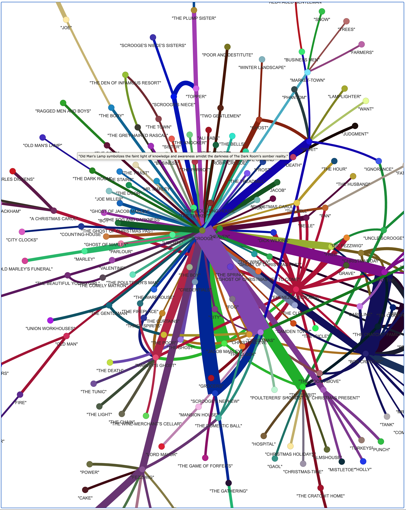

# Graph-based RAG lightRAG framework with gpt_4o_mini_complete LLM example

**Table of Contents**

- [What is in this example?](#what-is-in-this-example)
- [lightRAG installation and knowledge data preparation](#lightrag-installation-and-knowledge-data-preparation)
- [Populates LightRAG graph representation](#populates-lightrag-graph-representation)
- [Performs various types of queries](#performs-various-types-of-queries)
- [Knowledge Graph Visualization](#knowledge-graph-visualization)
- [Things to pay attention to](#things-to-pay-attention-to)

## What is in this example? 
**This is an example of using lightRAG framework for Graph-based RAG.**\
The example comprises of 
- LightRAG installation and knowledge data preparation 

and three main Python scripts.
- Populates LightRAG graph representation 
- Performs various types of queries 
- Knowledge Graph Visualization


**Technologies and frameworks used:**

gpt_4o_mini_complete OpenAI LLM, Graph-based RAG lightRAG framework, nano-vectordb Vector DB, Python


## lightRAG installation and knowledge data preparation 
The following guidelines were used:\
https://github.com/HKUDS/LightRAG?tab=readme-ov-file\
https://www.youtube.com/watch?v=g21royNJ4fw


Get your [OpenAI API key](https://platform.openai.com/api-keys)


Already cloned into LightRAG folder of the sample.\
```git clone https://github.com/HKUDS/LightRAG.git```

```cd LightRAG```


Create python's Virtual Environment\
`python3 -m venv .`

Check OPENAI_API_KEY environment variable\
`printenv`\
`export OPENAI_API_KEY="your-api-key"`

`source bin/activate`

`pip install -e .`

Download the book that would be used as source of knowledge stored as a graph.\
`curl https://raw.githubusercontent.com/gusye1234/nano-graphrag/main/tests/mock_data.txt > ./book.txt`

The folder would be used to store graph DB files.\
`mkdir dickens`


## Populates LightRAG graph representation 
This script initializes a LightRAG instance and populates its graph representation 
with knowledge extracted from the content of a text file ('book.txt').

Run this script\
`python run_to_init_graph_db.py`

[Script execution log](readme_files/run_to_init_graph_db.log)


## Performs various types of queries 
This script initializes a LightRAG instance and performs various types of queries 
(naive, local, global, and hybrid) on the data extracted from a text file.

Run this script\
`python run_to_retrieval.py`

[Script execution log](readme_files/run_to_retrieval.log)


## Knowledge Graph Visualization
[See doc here.](https://github.com/HKUDS/LightRAG?tab=readme-ov-file#graph-visualization)

Run this script\
`python examples/graph_visual_with_html.py`

Generated knowledge graph as html file\
[Generated knowledge graph as html file](LightRAG/knowledge_graph.html)

Generated knowledge graph as png image\



## Things to pay attention to
TBD


