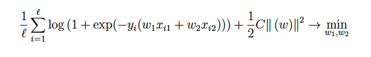
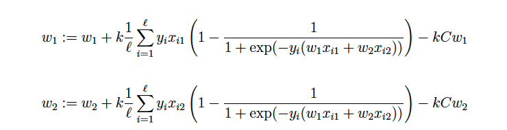

# Logistic Regression

This task is based on the materials of the lectures on logistic regression.

## You will learn:

- work with logistic regression
- implement gradient descent to configure it
- use regularization

## Introduction

Logistic regression is one of the types of linear classifiers.
One of its features is the ability to estimate class probabilities, while most linear classifiers can only output class numbers.
Logistic regression uses a fairly complex quality functional, which does not allow the solution to be written explicitly (unlike, for example, linear regression). However, logistic
regression can be configured using gradient descent.
We will work with a sample containing two features. To set up logistic regression, we will solve the following problem:

Here xi1 and xi2 are the values ​​of the first and second features, respectively, on the object xi. The gradient step for the weights will look like this (check for yourself that the derivative of our functional is actually written out here):

Here k is the step size.
Linear methods can overfit and give poor quality due to various problems in the data: multicollinearity, noise,
etc. To avoid this, regularization should be used - it
allows you to reduce the complexity of the model and prevent overfitting.

## Implementation in Scikit-Learn

In this task, we suggest that you implement the gradient descent yourself.
As a quality metric, we will use AUC-ROC (Area
Under ROC-Curve). It is intended for binary classification algorithms that provide an assessment of the object's belonging to one of the classes. In essence, the value of this metric is an aggregation of the quality indicators of all algorithms that can be obtained by choosing a threshold for assessing belonging.
In Scikit-Learn, the AUC metric is implemented by the sklearn.metrics.roc_auc_score function.
As the first argument, it receives a vector of true answers,
as the second - a vector with assessments of the objects' belonging to the first class.

## Materials

- More about logistic regression and predicting probabilities with it
- More about gradients and gradient descent

## Instructions for execution

1. Load data from the data-logistic.csv file. This is a two-dimensional sample, the target variable on which takes the values ​​0 or 1.
2. Make sure that the above formulas for gradient descent are correct.
3. Implement gradient descent for regular and L2-regularized (with a regularization coefficient of 10) logistic regression. Use a step length of k = 0.1.
4. Run gradient descent and bring to convergence (the Euclidean distance between the weight vectors at adjacent iterations should be no more than 1e-5). It is recommended to limit the number of iterations from above to ten thousand.
5. What is the value of AUC-ROC during training in the case with and without regularization? These values ​​will be the answer to the task.

If the answer is a non-integer number, then the integer and fractional parts
must be separated by a dot, for example, 0.421. If necessary, round the fractional part to three digits.
The answer to each task is a text file containing the answer in
the first line. Please note that the files submitted should not contain an empty line at the end. This nuance is a limitation of the Coursera platform. We are working to remove this
limitation.