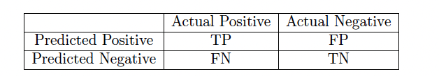

# Метрикикачестваклассификации

Данное задание основано на материалах лекций по метрикам каче-
ства классификации.

## Вы научитесь:

- вычислять различные меры качества классификации: долю пра-
    вильных ответов, точность, полноту, AUC-ROC и т.д.
- сравнивать алгоритмы классификации при наличии ограничений
    на точность или полноту

## Введение

В задачах классификации может быть много особенностей, влияющих на
подсчет качества: различные цены ошибок, несбалансированность клас-
сов и т.д. Из-за этого существует большое количество метрик качества
- каждая из них рассчитана на определенное сочетание свойств задачи
и требований к ее решению.
Меры качества классификации можно разбить на две большие груп-
пы: предназначенные для алгоритмов, выдающих номера классов, и для
алгоритмов, выдающих оценки принадлежности к классам. К первой
группе относятся доля правильных ответов, точность, полнота, F-мера.
Ко второй - площади под ROC- или PR-кривой.

## Реализация в sklearn

Различные метрики качества реализованы в пакете sklearn.metrics. Кон-
кретные функции указаны в инструкции по выполнению задания.

## Материалы

Подробнее о метриках качества

## Инструкция по выполнению

1. Загрузите файл classification.csv. В нем записаны истинные классы
    объектов выборки (колонка true) и ответы некоторого классифика-
    тора (колонка predicted).
2. Заполните таблицу ошибок классификации:

3. Для этого подсчитайте величины TP, FP, FN и TN согласно их
    определениям. Например, FP - это количество объектов, имеющих
    класс 0, но отнесенных алгоритмом к классу 1. Ответ в данном
    вопросе - четыре числа через пробел.
4. Посчитайте основные метрики качества классификатора:
    - Accuracy (доля верно угаданных) - sklearn.metrics.accuracy
    - Precision (точность) - sklearn.metrics.accuracy.precision_score
    - Recall (полнота) - sklearn.metrics.recall_score
    - F-мера - sklearn.metrics.f1_score
5. Имеется четыре обученных классификатора. В файле scores.csv за-
    писаны истинные классы и значения степени принадлежности по-
    ложительному классу для каждого классификатора на некоторой
    выборке:
       - для логистической регрессии - вероятность положительного
          класса (колонка score_logreg),
       - для SVM - отступ от разделяющей поверхности (колонка score_svm),
       - для метрического алгоритма - взвешенная сумма классов со-
          седей (колонка score_knn),

- для решающего дерева - доля положительных объектов в ли-
    сте (колонка score_tree).

Загрузите этот файл.

6. Посчитайте площадь под ROC-кривой для каждого классифика-
    тора. Какой классификатор имеет наибольшее значение метрики
    AUC-ROC (укажите название столбца с ответами этого классифи-
    катора)? Воспользуйтесь функцией sklearn.metrics.roc_auc_score.
7. Какой классификатор достигает наибольшей точности (Precision)
    при полноте (Recall) не менее 70% (укажите название столбца с от-
    ветами этого классификатора)? Какое значение точности при этом
    получается?

Чтобы получить ответ на этот вопрос, найдите все точки precision-
recall-кривой с помощью функции sklearn.metrics.precision_recall_curve.
Она возвращает три массива: precision, recall, thresholds. В них записа-
ны точность и полнота при определенных порогах, указанных в массиве
thresholds. Найдите максимальной значение точности среди тех записей,
для которых полнота не меньше, чем 0.7.
При необходимости округляйте ответ до двух знаков после запятой.
Ответ на каждое задание - текстовый файл, содержащий ответ в
первой строчке. Обратите внимание, что отправляемые файлы не долж-
ны содержать пустую строку в конце. Данный нюанс является ограни-
чением платформы Coursera. Мы работаем над тем, чтобы убрать это
ограничение.

