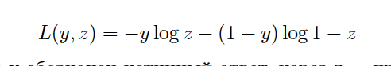
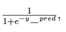

# Градиентный бустинг над решающими деревьями

Данное задание основано на материалах лекций по композициям ал-
горитмов.

## Вы научитесь:

- работать с градиентным бустингом и подбирать его гиперпарамет-
    ры
- сравнивать разные способы построения композиций
- понимать, в каком случае лучше использовать случайный лес, а в
    каком - градиентный бустинг
- использовать метрику log-loss

## Введение

Построение композиции - важный подход в машинном обучении, ко-
торый позволяет объединять большое количество слабых алгоритмов в
один сильный. Данный подход широко используется на практике в самых
разных задачах.
На лекциях был рассмотрен метод градиентного бустинга, который
последовательно строит композицию алгоритмов, причем каждый следу-
ющий алгоритм выбирается так, чтобы исправлять ошибки уже имею-
щейся композиции. Обычно в качестве базовых алгоритмов используют
деревья небольшой глубины, поскольку их достаточно легко строить, и
при этом они дают нелинейные разделяющие поверхности.


Другой метод построения композиций - случайный лес. В нем, в от-
личие от градиентного бустинга, отдельные деревья строятся независимо
и без каких-либо ограничений на глубину - дерево наращивается до тех
пор, пока не покажет наилучшее качество на обучающей выборке.
В этом задании мы будем иметь дело с задачей классификации. В
качестве функции потерь будем использовать log-loss:



Здесь через y обозначен истинный ответ, через z - прогноз алгорит-
ма. Данная функция является дифференцируемой, и поэтому подходит
для использования в градиентном бустинге. Также можно показать, что
при ее использовании итоговый алгоритм будет приближать истинные
вероятности классов.

## Реализация в sklearn

В пакете scikit-learn градиентный бустинг реализован в модуле ensemble в
виде классов GradientBoostingClassifier и GradientBoostingRegressor. Ос-
новные параметры, которые будут интересовать нас: n_estimators, learning_rate.
Иногда может быть полезен параметр verbose для отслеживания процес-
са обучения.
Чтобы была возможность оценить качество построенной композиции
на каждой итерации, у класса есть метод staged_decision_function. Для
заданной выборки он возвращает ответ на каждой итерации.
Помимо алгоритмов машинного обучения, в пакете scikit-learn пред-
ставлено большое число различных инструментов. В этом задании будет
предложено воспользоваться функцией train_test_split модуля cross_validation.
С помощью нее можно разбивать выборки случайным образом. На вход
можно передать несколько выборок (с условием, что они имеют одина-
ковое количество строк). Пусть, например, имеются данные X и y, где
X - это признаковое описание объектов, y - целевое значение. Тогда
следующий код будет удобен для разбиения этих данных на обучающее
и тестовое множества:

```Python
X_train , X_test , y_train , y_test =
train_test_split (X,y, test_size =0.33 , random_state=42)
```

Обратите внимание, что при фиксированом параметре random_state
результат разбиения можно воспроизвести.
Метрика log-loss реализована в пакете metrics.

## Материалы

Подробнее о градиентном бустинге и особенностях его применения к де-
ревьям

## Данные

В рамках данного задания мы рассмотрим датасет с конкурса Predicting
a Biological Response.

## Инструкция по выполнению

1. Загрузите выборку из файла gbm-data.csv с помощью pandas и пре-
    образуйте ее в массив numpy (параметр values у датафрейма). В
    первой колонке файла с данными записано, была или нет реакция.
    Все остальные колонки (d1 - d1776) содержат различные характери-
    стики молекулы, такие как размер, форма и т.д. Разбейте выборку
    на обучающую и тестовую, используя функцию train_test_split с
    параметрами test_size = 0.8 и random_state = 241.
2. Обучите GradientBoostingClassifier с параметрами n_estimators=250,
    verbose=True, random_state=241 и для каждого значения learning_rate
    из списка [1, 0.5, 0.3, 0.2, 0.1] проделайте следующее:
       - Используйте метод staged_decision_function для предсказа-
          ния качества на обучающей и тестовой выборке на каждой
          итерации.
       - Преобразуйте полученное предсказание по формуле ,
          где y_pred - предсказаное значение.


- Вычислите и постройте график значений log-loss на обучаю-
    щей и тестовой выборках, а также найдите минимальное зна-
    чение метрики и номер итерации, на которой оно достигается.
3. Как ведет себя график качества на тестовой выборке с уменьшени-
ем параметра learning_rate? Обратите внимание, что чем меньше
learning_rate, тем позднее алгоритм начинаем переобучаться.
4. На этих же данных обучите RandomForestClassifier с количеством
деревьев, равным количеству итераций, на котором достигается
наилучшее качество у градиентного бустинга из предыдущего пунк-
та, random_state=241 и остальными параметрами по умолчанию.

При необходимости округляйте ответ до третьего знака.
Обратите внимание, что, хотя в градиентного бустинге гораздо бо-
лее слабые базовые алгоритмы, он выигрывает у случайного леса бла-
годаря более "направленной"настройке - каждый следующий алгоритм
исправляет ошибки имеющейся композиции. Также он обучается быст-
рее случайного леса благодаря использованию неглубоких деревьев. В
то же время, случайный лес может показать более высокое качество при
неограниченных ресурсах - так, он выиграет у градиентного бустинга
на наших данных, если увеличить число деревьев до нескольких сотен
(проверьте сами!).
Ответ на каждое задание - текстовый файл, содержащий ответ в
первой строчке. Обратите внимание, что отправляемые файлы не долж-
ны содержать перенос строки в конце. Данный нюанс является ограни-
чением платформы Coursera. Мы работаем над тем, чтобы убрать это
ограничение.


