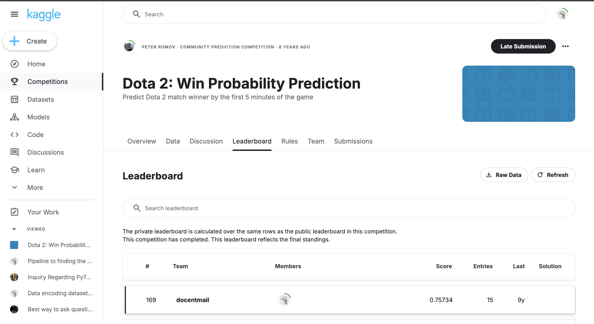

# Dota 2: Win Probability Prediction (Kaggle Competition)

Predict Dota 2 match winner by the first 5 minutes of the game

[Kaggle Competition](https://www.kaggle.com/competitions/dota-2-win-probability-prediction/overview)
The training set consists of matches, for which all of the ingame events (like kills, item purchase etc.) as well as match outcome are know. You are given only the first 5 minutes of each match and you need to predict the likelihood of Radiant victory.

### Result of Kaggle Leaderboard
Kaggle Leaderboard Result: **169** out of 810 

### Folders and files structure
- **_assignment.md**- description of the tasks that need to be solved in the assignment
- folder **dota_kaggle_submission** calclulations
  - **dota_kaggle_submission/dota2-kaggle-04.ipynb** - the notebook with main calculations
  - **folders dota_kaggle_submission/Dota2_01, dota_kaggle_submission/Dota2_02, dota_kaggle_submission/Dota2_03** - intermediate calculations

- file **[dota_kaggle_data.zip](https://www.kaggle.com/competitions/dota-2-win-probability-prediction/data)** - Dota2 Kaggle dataset 
  - The dataset is provided in compressed JSON format (`matches.jsonlines.bz2`) with structured match details.
  - Features include:
    - Player statistics (e.g., experience, gold, kills, deaths, items).
    - Team statistics (e.g., first blood events, hero selection).
    - Match meta-data (e.g., start time, lobby type).
  - Additional datasets include pre-processed feature tables (`features.csv`) and a test dataset (`features_test.csv`).

- folder **dota_kaggle_features** - Additional datasets include pre-processed feature tables (`features.csv`) and a test dataset (`features_test.csv`).

### Used Technologies and Packages

- **IPython.display**: For displaying objects interactively in the notebook.
- **datetime**: Utilized for handling date and time data.
- **math**: For mathematical operations.
- **numpy**: Used for numerical computations and array manipulations.
- **pandas**: For data manipulation and analysis, including handling of DataFrames.
- **scipy.sparse**: For working with sparse matrices.
- **scipy.stats**: For statistical operations.
- **sklearn.cross_validation**: Used for splitting data into training and testing sets.
- **sklearn.ensemble**: For ensemble methods like RandomForest.
- **sklearn.grid_search**: For hyperparameter optimization.
- **sklearn.linear_model**: For implementing linear models such as Logistic Regression.
- **sklearn.metrics**: For evaluating model performance.
- **sklearn.preprocessing**: For preprocessing data, such as normalization or scaling.
- **sklearn.tree**: For decision tree models.
- **sys**: Used for system-specific parameters and functions.
- **warnings**: For managing warnings during execution.

