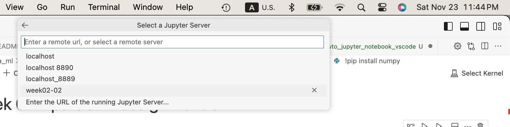

<p style="font-size: 26px;"> Jupyter Notebook in VS Code </p>

# Table of Contents

- [Start Jupyter Notebooks in venv virtual environment](#start-jupyter-notebooks-in-venv-virtual-environment)
- [Use Environment variable in Jupyter Notebook](#use-environment-variable-in-jupyter-notebook)
- [Get Jupyter Notebook running in VS Code](#get-jupyter-notebook-running-in-vs-code)
- [Debug Jupyter Notebook in VS Code](#debug-jupyter-notebook-in-vs-code)

## Start Jupyter Notebooks in venv virtual environment 
**TL;DR**
- create venv;
- activate venv;
- install Jupyther Notebook package in venv;
- Start Jupyther Notebook server
- Start Jupyther Notebook server
- after that !pip install numpy puts the package in venv


**More details**/
create a venv  (python3 -m venv venv_name)\
activate it (unix-like: source venv_name/bin/activate)\
install jupyter notebook in that venv while it's activated (pip install notebook)\
open the jupyter notebook (jupyter notebook)\


**Commands in the terminal**
```
cd YOUR_PATH/howto_jupyter_notebook_vscode
python3 -m venv .
source bin/activate
pip install notebook
jupyter notebook
```

See jupyter server in the browser: http://localhost:8889/tree


Open notebook in browser ```test_venv_vs.ipynb```


Run notebook:

You can see ```KeyError: 'TEST_ENV_VAR'``` it is fine for now.


## Use Environment variable in Jupyter Notebook
**Prerequisites:**
- done with section **Start Jupyter Notebooks in venv virtual environment**
- you are in YOUR_PATH/howto_jupyter_notebook_vscode folder in terminal


**Step**:Set TEST_ENV_VAR Environment variable
Stop the Jupyter Notebook

In terminal terminal\
```export TEST_ENV_VAR="Hello from TEST_ENV_VAR"```

```printenv```\
should contain this line 
```TEST_ENV_VAR=Hello from TEST_ENV_VAR```

**Step**:  Start Jupyther Notebook server\
```jupyter notebook```

**Step**:  Run the notebook in browser


you can see ```TEST_ENV_VAR: Hello from TEST_ENV_VAR``` now 

## Run Jupyter Notebook 
```jupyter notebook```
The notebook is secured by token
http://localhost:8889/tree?token=1f0a6dec7912dc04ed898518b5448e166416c77fdb25204a


## Get Jupyter Notebook running in VS Code 
**Prerequisites:**
- running Jupyter Server
- Server URL URL with token


**Step:**
Copy notebook server URL with token\
```http://localhost:8889/tree?token=1f0a6dec7912dc04ed898518b5448e166416c77fdb25204a```


**Step:**
Click ```select kernel```


**Step:**
Pick ```Existing Jupiter Server```


**Step:**
Paste the server URL with the token


**Step:**
Give the server configuration a name ```week02-02```




**Step:**
Pick ```Python 3 (ipykernel)```


**Step:**
```Python 3 (ipykernel) week02-02 — Currently selected``` is present in the ```Select a Jupyter Server``` dropdown\
and\
```Python 3 (ipykernel) ``` appears in the ```Select Kernel``` icon


## Debug Jupyter Notebook in VS Code

**Step** Add breakpoint


**Step** Debug cell:\
MacOs [Control+Shift+Return]


