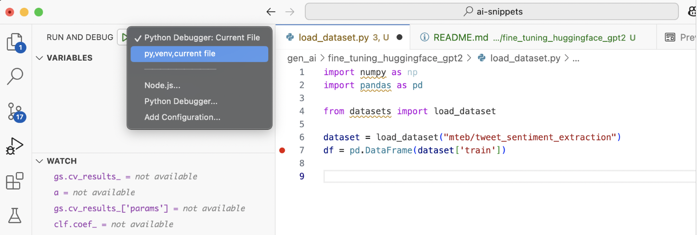
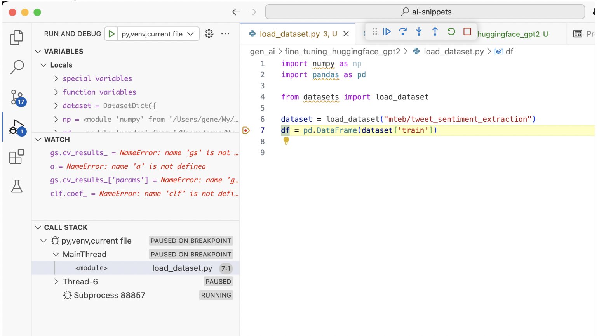

<p style="font-size: 26px;"> Running/debugging Python file + venv in VS Code </p>

# Table of Contents

- [Case 1: Python file; VS Code debugging; existing venv](#case-1-python-file-vs-code-debugging-existing-venv)


## Case 1: Python file; VS Code debugging; existing venv

**Case:**
- You have `.../the_folder/the_file.py` (**Important:** the file is in the same folder where venv is. )
- There is venv already created in `.../the_folder` with installed packages
- You need debug `the_file.py` in VS Code in the existing venv.

**Solution:**
`
In `.vscode/launch.json` from your workspace, add the following debugging configurations.

```
{
"name": "py,venv,current file",
"type": "debugpy",
"request": "launch",
"program": "${file}",
"console": "integratedTerminal",
"cwd": "${fileDirname}",
"python": "${fileDirname}/bin/python"
}
```

Open `the_file.py` in the VS Code editor

Go to RUN AND DEBUG (Command+Shift+D) and pick configuration with name  `py,venv,current file`




`F5` — to start debugging (it works the same way as `source bin/activate` in terminal)




**Useful links**
[Python debugging in VS Code](https://code.visualstudio.com/docs/python/debugging)


