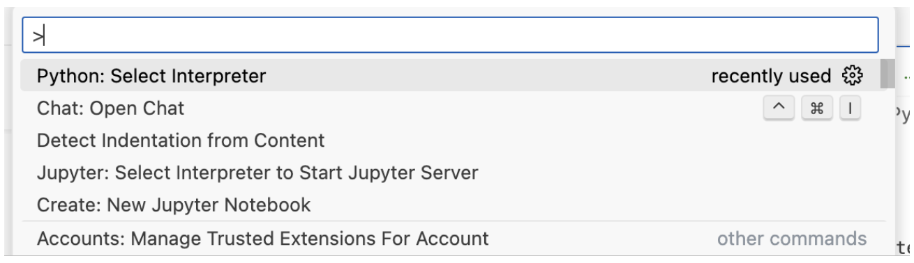
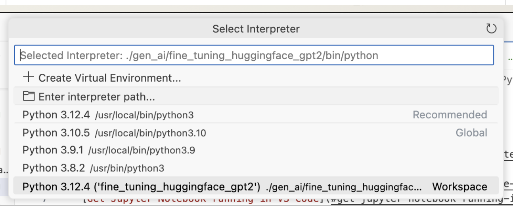
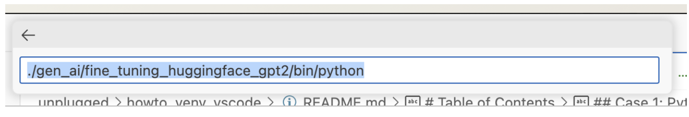
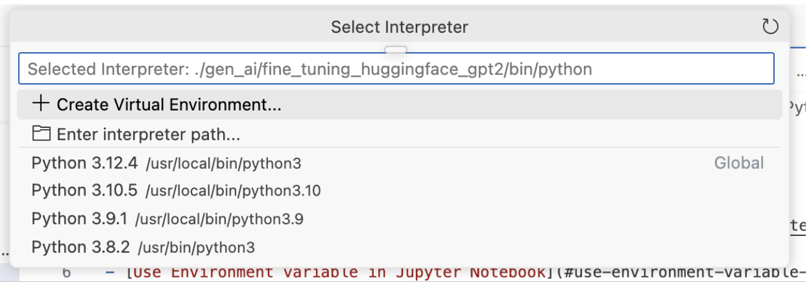
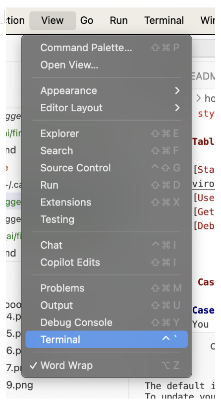
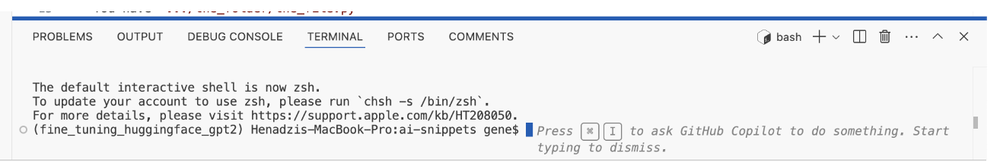
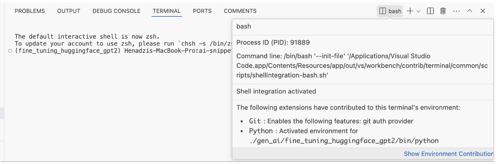

<p style="font-size: 26px;"> Running/debugging Python file + venv in VS Code </p>

# Table of Contents

## Table of Contents

- [Case 1: Python file; VS Code debugging; existing venv](#case-1-python-file-vs-code-debugging-existing-venv)
- [Case 2: Open VS Code integrated terminal with active existing venv](#case-2-open-vs-code-integrated-terminal-with-active-existing-venv)


## Case 1: Python file; VS Code debugging; existing venv

**Case:**
- You have `.../the_folder/the_file.py` (**Important:** the file is in the same folder where venv is. )
- There is venv already created in `.../the_folder` with installed packages
- You need debug `the_file.py` in VS Code in the existing venv.

**Solution:**

`
In `.vscode/launch.json` from your workspace, add the following debugging configurations.

```
{
"name": "py,venv,current file",
"type": "debugpy",
"request": "launch",
"program": "${file}",
"console": "integratedTerminal",
"cwd": "${fileDirname}",
"python": "${fileDirname}/bin/python"
}
```

Open `the_file.py` in the VS Code editor

Go to RUN AND DEBUG (Command+Shift+D) and pick configuration with name  `py,venv,current file`


`F5` — to start debugging (it works the same way as `source bin/activate` in terminal)


**Useful links**
[Python debugging in VS Code](https://code.visualstudio.com/docs/python/debugging)


## Case 2: Open VS Code integrated terminal with active existing venv
**Case:**
- There is venv already created in `.../gen_ai/fine_tuning_huggingface_gpt2` with installed packages
- You need VS Code integrated terminal with the venv active.

**Solution:**

[`Command+Shift+p`]  Python: Select Interpreter








Enter interpreter path\
`./gen_ai/fine_tuning_huggingface_gpt2/bin/python`





Open the terminal by selecting `View > Terminal` from the menu bar or pressing the ⌃+` keyboard shortcut.




`fine_tuning_huggingface_gpt2` is now active venv in this VS Code integrated terminal.






